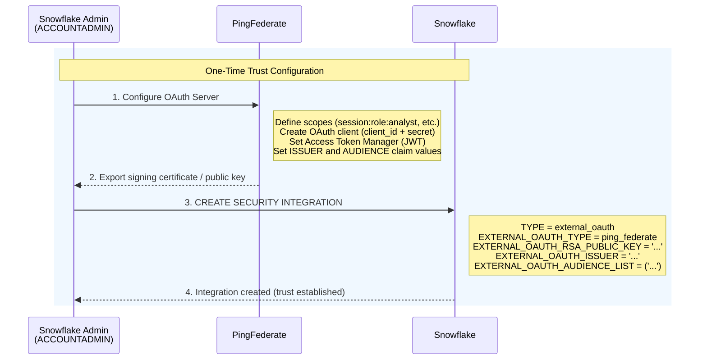
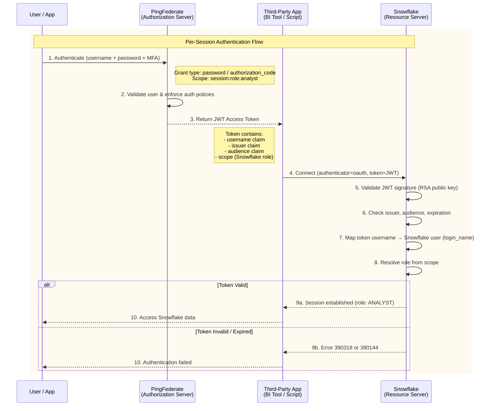

# External OAuth with Snowflake and Ping Identity

## What is External OAuth?

External OAuth is a mechanism where Snowflake delegates authentication and authorization to an **external OAuth 2.0 authorization server** (like Ping Identity PingFederate, Okta, or Microsoft Entra ID) rather than handling credentials itself. Instead of users providing Snowflake passwords, they authenticate against the external identity provider (IdP), which issues a **JWT access token**. Snowflake validates that token and grants access.

This is in contrast to **Snowflake OAuth**, where Snowflake itself acts as both the authorization server and the resource server.

## How It Works (End-to-End Flow)

### Architecture Overview

```mermaid
graph LR
    subgraph "Identity Provider"
        PF[PingFederate<br/>Authorization Server]
    end

    subgraph "Client Layer"
        U[User / Service Account]
        APP[Third-Party Application<br/>BI Tool / Custom App]
    end

    subgraph "Snowflake"
        SI[Security Integration<br/>TYPE = external_oauth<br/>EXTERNAL_OAUTH_TYPE = ping_federate]
        TV[Token Validation<br/>RSA Public Key / JWS URL]
        UM[User Mapping<br/>login_name or email_address]
        S[Session<br/>Role from scope]
        DATA[(Snowflake Data)]
    end

    U -- "1. Authenticate<br/>(credentials + MFA)" --> PF
    PF -- "2. JWT Access Token<br/>(username, issuer,<br/>audience, scopes)" --> APP
    APP -- "3. Connect with<br/>authenticator=oauth<br/>+ token" --> SI
    SI --> TV
    TV -- "4. Verify signature,<br/>issuer, audience,<br/>expiration" --> UM
    UM -- "5. Map token claim<br/>to Snowflake user" --> S
    S -- "6. Access granted<br/>with scoped role" --> DATA

    style PF fill:#0052CC,color:#fff
    style SI fill:#29B5E8,color:#fff
    style TV fill:#29B5E8,color:#fff
    style UM fill:#29B5E8,color:#fff
    style S fill:#29B5E8,color:#fff
    style DATA fill:#196B8A,color:#fff
    style APP fill:#6554C0,color:#fff
```



### One-Time Setup



### Per-Session Flow



### One-Time Setup (Steps)

1. Configure PingFederate as the OAuth authorization server (define scopes, clients, token management).
2. Create a **security integration** in Snowflake that establishes trust with PingFederate.

### Per-Session Flow (Steps)

1. A user/application authenticates against **PingFederate** (e.g., via Resource Owner Password Credentials grant, or another OAuth flow).
2. PingFederate validates the user and issues a **JWT access token** containing claims like `username`, `issuer`, `audience`, and **scopes** (which map to Snowflake roles, e.g., `session:role:analyst`).
3. The third-party application passes this token to Snowflake via a driver/connector with `authenticator="oauth"`.
4. Snowflake validates the token:
   - Verifies the JWT signature using the RSA public key or JWS keys URL configured in the security integration.
   - Checks the issuer, audience, and expiration.
   - Maps the token's user claim to a Snowflake user (via `login_name` or `email_address`).
5. On success, Snowflake instantiates a session with the role specified in the token's scope.

## Scopes (Role Mapping)

Scopes control what Snowflake role the user gets:

| Scope | Meaning |
|-------|---------|
| `session:role:<role_name>` | Maps to a specific Snowflake role (e.g., `session:role:analyst`) |
| `session:role-any` | Uses the user's default Snowflake role (requires `external_oauth_any_role_mode = ENABLE`) |

Scopes are defined in PingFederate as **Exclusive Scopes** and must have the `session:role:` prefix.

## Setting Up the Snowflake Security Integration

The ACCOUNTADMIN creates a security integration like this:

```sql
CREATE OR REPLACE SECURITY INTEGRATION external_oauth_pf
    TYPE = external_oauth
    ENABLED = true
    EXTERNAL_OAUTH_TYPE = ping_federate
    EXTERNAL_OAUTH_ISSUER = '<ping_issuer_id>'
    EXTERNAL_OAUTH_RSA_PUBLIC_KEY = '<base64_encoded_public_key>'
    EXTERNAL_OAUTH_TOKEN_USER_MAPPING_CLAIM = 'username'
    EXTERNAL_OAUTH_SNOWFLAKE_USER_MAPPING_ATTRIBUTE = 'login_name'
    EXTERNAL_OAUTH_AUDIENCE_LIST = ('https://<account>.snowflakecomputing.com');
```

### Key Parameters

- **`EXTERNAL_OAUTH_ISSUER`** -- The unique identifier of your PingFederate authorization server.
- **`EXTERNAL_OAUTH_RSA_PUBLIC_KEY`** -- Public key exported from PingFederate to verify token signatures.
- **`EXTERNAL_OAUTH_TOKEN_USER_MAPPING_CLAIM`** -- Which JWT claim contains the username (typically `'username'`).
- **`EXTERNAL_OAUTH_SNOWFLAKE_USER_MAPPING_ATTRIBUTE`** -- Which Snowflake user attribute to match against (`login_name` or `email_address`).
- **`EXTERNAL_OAUTH_AUDIENCE_LIST`** -- Must match the Audience Claim Value configured in PingFederate.

## How a Third-Party App Connects

### 1. Obtain a Token from PingFederate

```bash
curl -k 'https://<pingfederate_host>:9031/as/token.oauth2' \
  --data-urlencode 'client_id=<client_id>' \
  --data-urlencode 'grant_type=password' \
  --data-urlencode 'username=<user>' \
  --data-urlencode 'password=<pass>' \
  --data-urlencode 'client_secret=<secret>' \
  --data-urlencode 'scope=session:role:analyst'
```

### 2. Pass the Token to a Snowflake Driver

```python
ctx = snowflake.connector.connect(
    user="<username>",
    host="<account>.snowflakecomputing.com",
    account="<account>",
    authenticator="oauth",
    token="<access_token>",
    warehouse="my_warehouse",
    database="my_db",
    schema="my_schema"
)
```

No Snowflake password is ever involved.

## Key Benefits

- **Centralized auth** -- All authentication policies (MFA, IP restrictions, biometrics) are enforced at the IdP, not Snowflake.
- **No Snowflake passwords needed** -- Service accounts/programmatic users never need a Snowflake password.
- **Cloud-agnostic** -- PingFederate can be on-premises or in any cloud.
- **Network policies** -- You can attach a Snowflake network policy to the security integration to restrict which IPs can connect via this OAuth path.

## Troubleshooting

Snowflake provides two system functions for debugging:

- `SYSTEM$VERIFY_EXTERNAL_OAUTH_TOKEN` -- Check if a token is valid or expired.
- `SYSTEM$GET_LOGIN_FAILURE_DETAILS` -- Get detailed error info using the UUID from a failed login.

## References

- [External OAuth overview](https://docs.snowflake.com/en/user-guide/oauth-ext-overview)
- [Configure PingFederate for External OAuth](https://docs.snowflake.com/en/user-guide/oauth-pingfed)
- [CREATE SECURITY INTEGRATION (External OAuth)](https://docs.snowflake.com/en/sql-reference/sql/create-security-integration-oauth-external)
