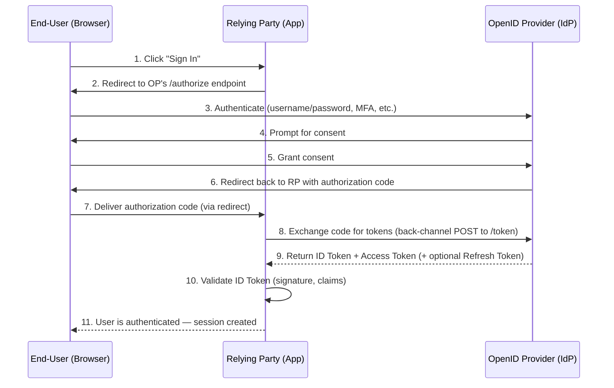
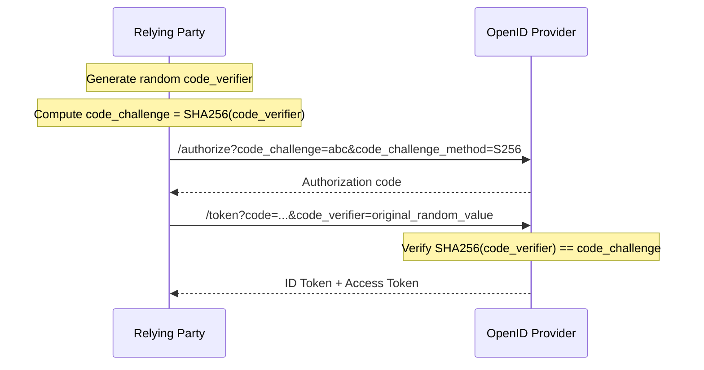

# OpenID Connect (OIDC)

OpenID Connect (OIDC) is an identity authentication protocol built on top of OAuth 2.0. While OAuth 2.0 handles **authorization** (what you can access), OIDC adds **authentication** (proving who you are).

In simple terms: OAuth 2.0 gives you a key to a room, OIDC checks your ID at the door first.

> **Specification:** [OpenID Connect Core 1.0](https://openid.net/specs/openid-connect-core-1_0.html)

---

## The Problem OIDC Solves

Before OIDC, every application had to build its own login system — storing passwords, handling resets, managing sessions. Users ended up with dozens of accounts and passwords.

OIDC lets you delegate authentication to a trusted provider. When you click "Sign in with Google" on a website, that's OIDC in action. Google verifies your identity and tells the website who you are, without the website ever seeing your Google password.

---

## Key Terminology

| Term | Also Known As | What It Means |
|---|---|---|
| **OpenID Provider (OP)** | Identity Provider (IdP) | The service that authenticates the user (e.g., Google, Okta, Microsoft Entra ID) |
| **Relying Party (RP)** | Client | The application that wants to know who the user is (e.g., Spotify, your internal app) |
| **End-User** | Resource Owner | The person logging in |
| **ID Token** | — | A JWT containing identity claims about the user |
| **Claims** | — | Pieces of information about the user (name, email, etc.) |
| **Scopes** | — | Permissions that define what user information the RP can access |
| **UserInfo Endpoint** | — | An API endpoint where the RP can fetch additional user profile data |

---

## How OIDC Relates to OAuth 2.0

```
┌─────────────────────────────────────────────────┐
│                                                 │
│              OpenID Connect (OIDC)              │
│         ┌─────────────────────────┐             │
│         │   Authentication Layer  │             │
│         │   (ID Token + Claims)   │             │
│         └─────────────────────────┘             │
│                                                 │
│  ┌─────────────────────────────────────────┐    │
│  │            OAuth 2.0                    │    │
│  │     (Authorization Framework)           │    │
│  │     Access Tokens, Refresh Tokens,      │    │
│  │     Scopes, Grant Types                 │    │
│  └─────────────────────────────────────────┘    │
│                                                 │
└─────────────────────────────────────────────────┘
```

**OAuth 2.0 alone** answers: _"Is this app allowed to access this resource?"_

**OIDC (OAuth 2.0 + identity layer)** also answers: _"Who is this user?"_

The key addition is the **ID Token** — a signed JWT that contains verifiable claims about the authenticated user.

---

## The Three OIDC Flows

OIDC defines three authentication flows. The **Authorization Code Flow** is the recommended one for most use cases.

| Flow | Use Case | Recommended |
|---|---|---|
| **Authorization Code Flow** | Server-side web apps, SPAs (with PKCE), mobile apps | Yes |
| **Implicit Flow** | Legacy browser-based apps that can't keep a client secret | No (deprecated in favor of Code + PKCE) |
| **Hybrid Flow** | Apps needing tokens from both the authorization endpoint and token endpoint | No (rarely needed) |

---

## Authorization Code Flow (Step by Step)

This is the most common and most secure OIDC flow.



### What happens at each step:

1. The user clicks a login button in the app (the Relying Party).
2. The app redirects the user's browser to the OpenID Provider's authorization endpoint with parameters like `client_id`, `redirect_uri`, `scope=openid`, and a `state` value for CSRF protection.
3. The OP authenticates the user (login form, SSO session, MFA — the method is up to the OP).
4. The OP asks the user to consent to sharing the requested information (e.g., email, profile).
5. The user grants consent.
6. The OP redirects the browser back to the app's `redirect_uri` with a short-lived **authorization code**.
7. The browser follows the redirect, delivering the code to the app.
8. The app sends a **back-channel** (server-to-server) POST request to the OP's token endpoint, including the authorization code and client credentials.
9. The OP returns an **ID Token** (always a JWT), an **Access Token**, and optionally a **Refresh Token**.
10. The app validates the ID Token — checking the signature, issuer (`iss`), audience (`aud`), expiration (`exp`), and nonce.
11. The app creates a session for the user. Authentication is complete.

> The authorization code is exchanged via a back-channel request (step 8) so that tokens never pass through the browser, reducing the risk of interception.

---

## The ID Token

The ID Token is what distinguishes OIDC from plain OAuth 2.0. It is a signed JWT (JSON Web Token) that contains claims about the authenticated user.

### Structure

A JWT has three base64url-encoded parts separated by dots: `header.payload.signature`

### Standard Claims

```json
{
  "iss": "https://accounts.google.com",
  "sub": "1102547839",
  "aud": "my-app-client-id",
  "exp": 1711929600,
  "iat": 1711926000,
  "nonce": "abc123xyz",
  "name": "Jane Doe",
  "email": "jane@example.com",
  "email_verified": true,
  "picture": "https://example.com/jane/photo.jpg"
}
```

| Claim | Required | Description |
|---|---|---|
| `iss` | Yes | Issuer — URL of the OP that issued the token |
| `sub` | Yes | Subject — unique identifier for the user at this OP |
| `aud` | Yes | Audience — the `client_id` of the RP this token was issued for |
| `exp` | Yes | Expiration time (Unix timestamp) |
| `iat` | Yes | Issued-at time (Unix timestamp) |
| `nonce` | Conditional | Value sent in the auth request, used to prevent replay attacks |
| `name` | No | Full name of the user |
| `email` | No | Email address |
| `email_verified` | No | Whether the email has been verified by the OP |

### ID Token vs Access Token

| | ID Token | Access Token |
|---|---|---|
| **Purpose** | Proves the user's identity to the RP | Grants access to a protected resource (API) |
| **Audience** | The client application (RP) | The resource server (API) |
| **Format** | Always a JWT | Can be JWT or opaque string |
| **Contains** | User identity claims | Authorization scopes/permissions |

---

## Standard Scopes

When the RP sends the authentication request, it specifies which scopes it wants. OIDC defines these standard scopes:

| Scope | Claims Returned |
|---|---|
| `openid` | `sub` (required — this scope makes it an OIDC request) |
| `profile` | `name`, `family_name`, `given_name`, `picture`, `gender`, `birthdate`, `locale`, etc. |
| `email` | `email`, `email_verified` |
| `address` | `address` (structured postal address) |
| `phone` | `phone_number`, `phone_number_verified` |

---

## Discovery and Well-Known Configuration

OIDC providers publish their configuration at a standardized URL so that clients can auto-discover endpoints, supported features, and signing keys:

```
https://<issuer>/.well-known/openid-configuration
```

Example response (abridged):

```json
{
  "issuer": "https://accounts.google.com",
  "authorization_endpoint": "https://accounts.google.com/o/oauth2/v2/auth",
  "token_endpoint": "https://oauth2.googleapis.com/token",
  "userinfo_endpoint": "https://openidconnect.googleapis.com/v1/userinfo",
  "jwks_uri": "https://www.googleapis.com/oauth2/v3/certs",
  "scopes_supported": ["openid", "profile", "email"],
  "response_types_supported": ["code", "id_token", "code id_token"],
  "subject_types_supported": ["public"],
  "id_token_signing_alg_values_supported": ["RS256"]
}
```

This is how libraries and drivers automatically know where to send authentication requests and how to validate tokens.

---

## PKCE Extension (Proof Key for Code Exchange)

For public clients (SPAs, mobile apps) that cannot securely store a `client_secret`, OIDC uses PKCE to protect the authorization code exchange.



Even if an attacker intercepts the authorization code, they cannot exchange it without the original `code_verifier`.

---

## Common OIDC Providers

| Provider | Issuer URL |
|---|---|
| Google | `https://accounts.google.com` |
| Microsoft Entra ID | `https://login.microsoftonline.com/{tenant}/v2.0` |
| Okta | `https://{domain}.okta.com` |
| Auth0 | `https://{domain}.auth0.com/` |
| Keycloak | `https://{host}/realms/{realm}` |
| GitHub (OIDC for Actions) | `https://token.actions.githubusercontent.com` |
| GitLab (CI/CD OIDC) | `https://gitlab.com` |

---

## OIDC in the Context of Snowflake

Snowflake uses OIDC in two key areas:

1. **Workload Identity Federation (WIF)** — Workloads running on Kubernetes (EKS, AKS, GKE), GitHub Actions, or GitLab CI authenticate to Snowflake by presenting an OIDC token issued by their platform's identity provider. Snowflake validates the token's `iss` (issuer) and `sub` (subject) claims against the service user's `WORKLOAD_IDENTITY` configuration. See [WorkloadIdentityFederation.md](WorkloadIdentityFederation.md).

2. **External OAuth** — Snowflake can accept OAuth access tokens from external authorization servers. The tokens are validated using the OIDC discovery document of the configured issuer. See [ExternalOAUTH.md](ExternalOAUTH.md).

### Example: Snowflake WIF with an OIDC provider

```sql
-- Snowflake service user for an EKS workload using OIDC
CREATE USER my_eks_service
  WORKLOAD_IDENTITY = (
    TYPE = OIDC
    ISSUER = 'https://oidc.eks.us-east-1.amazonaws.com/id/ABC123'
    SUBJECT = 'system:serviceaccount:my-namespace:my-service-account'
  )
  TYPE = SERVICE;
```

The Snowflake driver on the workload obtains an OIDC token from the Kubernetes service account token volume, and Snowflake validates it against the configured `ISSUER` and `SUBJECT`.

---

## References

- [OpenID Connect Core 1.0 Specification](https://openid.net/specs/openid-connect-core-1_0.html)
- [OAuth 2.0 Authorization Framework (RFC 6749)](https://datatracker.ietf.org/doc/html/rfc6749)
- [JSON Web Token (RFC 7519)](https://datatracker.ietf.org/doc/html/rfc7519)
- [PKCE (RFC 7636)](https://datatracker.ietf.org/doc/html/rfc7636)
- [OpenID Connect Discovery 1.0](https://openid.net/specs/openid-connect-discovery-1_0.html)
- [Snowflake WIF Documentation](https://docs.snowflake.com/en/user-guide/workload-identity-federation)
