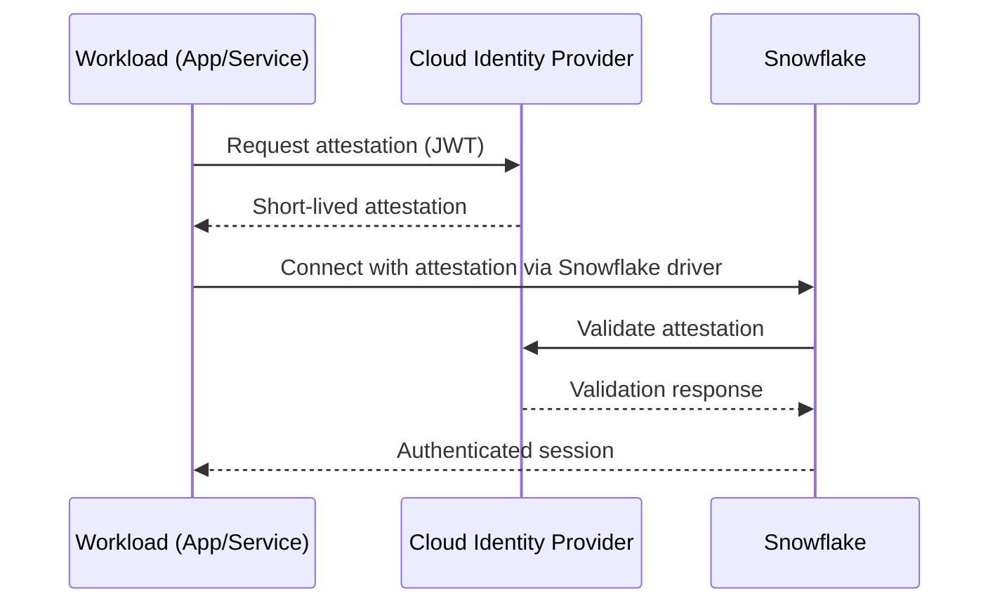

# Workload Identity Federation (WIF) with Snowflake

Workload Identity Federation (WIF) is a service-to-service authentication method that lets workloads — applications, services, or containers — authenticate to Snowflake using their cloud provider's native identity system instead of static credentials like passwords, API keys, or key pairs.

The workload obtains a short-lived attestation (typically a JWT) from its identity provider, and Snowflake validates it to establish a session. No secrets are stored in code or configuration.

> **Reference:** [Snowflake WIF Documentation](https://docs.snowflake.com/en/user-guide/workload-identity-federation)

---

## Why WIF?

| Benefit | Description |
|---|---|
| **Secretless authentication** | Eliminates long-lived credentials (passwords, key pairs, OAuth client secrets) |
| **Cost effective** | Leverages existing cloud IdPs — no additional tools or licenses needed |
| **Interoperability** | Supported by AWS IAM, Microsoft Entra ID, Google Cloud, and OIDC providers |
| **Auditable** | Activity logged via CloudTrail, Azure Monitor, etc. Snowflake exposes `LOGIN_HISTORY` and `CREDENTIALS` views in `ACCOUNT_USAGE` |

### WIF vs External OAuth

External OAuth requires provisioning and managing an OAuth authorization server (e.g., PingFederate, Okta), configuring client credentials, and creating a Snowflake security integration. WIF removes that overhead — the cloud platform itself acts as the identity provider.

---

## How It Works



**Three-step workflow:**

1. **Workload Admin** — Configure the workload to use a native identity provider (AWS IAM role, Azure Managed Identity, GCP service account, or OIDC issuer).
2. **Snowflake Admin** — Create a Snowflake `SERVICE` user whose `WORKLOAD_IDENTITY` properties match the attestation issued by the provider.
3. **Workload Developer** — Configure the Snowflake driver with `authenticator='WORKLOAD_IDENTITY'`.

---

## Supported Identity Providers

| Provider | `TYPE` | Required Parameters |
|---|---|---|
| AWS IAM | `AWS` | `ARN` |
| Microsoft Entra ID | `AZURE` | `ISSUER`, `SUBJECT` |
| Google Cloud | `GCP` | `SUBJECT` |
| OIDC (GitHub, GitLab, Kubernetes) | `OIDC` | `ISSUER`, `SUBJECT`, optionally `OIDC_AUDIENCE_LIST` |

---

## Access Control Requirements

To configure WIF for a service user, your activated role must have one of:

- `OWNERSHIP` on the service user
- `MODIFY PROGRAMMATIC AUTHENTICATION METHODS` on the service user

---

## Creating Service Users

### AWS

```sql
CREATE USER my_aws_service
  WORKLOAD_IDENTITY = (
    TYPE = AWS
    ARN = '<iam_role_arn>'
  )
  TYPE = SERVICE
  DEFAULT_ROLE = PUBLIC;
```

### Microsoft Azure (Entra ID)

```sql
CREATE USER my_azure_service
  WORKLOAD_IDENTITY = (
    TYPE = AZURE
    ISSUER = 'https://login.microsoftonline.com/<tenant_id>/v2.0'
    SUBJECT = '<object_principal_id>'
  )
  TYPE = SERVICE
  DEFAULT_ROLE = PUBLIC;
```

### Google Cloud

```sql
CREATE USER my_gcp_service
  WORKLOAD_IDENTITY = (
    TYPE = GCP
    SUBJECT = 'service_account@my-project.iam.gserviceaccount.com'
  )
  TYPE = SERVICE
  DEFAULT_ROLE = PUBLIC;
```

### OIDC (Kubernetes, GitHub Actions, GitLab CI, Custom)

```sql
-- EKS example
CREATE USER my_eks_service
  WORKLOAD_IDENTITY = (
    TYPE = OIDC
    ISSUER = 'https://oidc.eks.<region>.amazonaws.com/id/<cluster_id>'
    SUBJECT = 'system:serviceaccount:<namespace>:<service_account>'
  )
  TYPE = SERVICE;

-- AKS example
CREATE USER my_aks_service
  WORKLOAD_IDENTITY = (
    TYPE = OIDC
    ISSUER = 'https://<aks_region>.oic.prod-aks.azure.com/<subscription>/<resource_group>/<cluster>'
    SUBJECT = 'system:serviceaccount:<namespace>:<service_account>'
  )
  TYPE = SERVICE;

-- GKE example
CREATE USER my_gke_service
  WORKLOAD_IDENTITY = (
    TYPE = OIDC
    ISSUER = 'https://container.googleapis.com/v1/projects/<project>/locations/<location>/clusters/<cluster>'
    SUBJECT = 'system:serviceaccount:<namespace>:<service_account>'
  )
  TYPE = SERVICE;

-- Custom OIDC provider
CREATE USER my_custom_service
  WORKLOAD_IDENTITY = (
    TYPE = OIDC
    ISSUER = '<issuer_url>'
    SUBJECT = '<subject_claim>'
    OIDC_AUDIENCE_LIST = ('<audience>')
  )
  TYPE = SERVICE;
```

> `OIDC_AUDIENCE_LIST` is only required if the ID token's audience claim is **not** `snowflakecomputing.com`.

---

## Connecting from Code (Python)

```python
import snowflake.connector

# AWS
conn = snowflake.connector.connect(
    account='<account_identifier>',
    authenticator='WORKLOAD_IDENTITY',
    workload_identity_provider='AWS'
)

# Azure
conn = snowflake.connector.connect(
    account='<account_identifier>',
    authenticator='WORKLOAD_IDENTITY',
    workload_identity_provider='AZURE'
)

# GCP
conn = snowflake.connector.connect(
    account='<account_identifier>',
    authenticator='WORKLOAD_IDENTITY',
    workload_identity_provider='GCP'
)
```

> For Azure user-assigned managed identities, set the `MANAGED_IDENTITY_CLIENT_ID` environment variable to the client ID of the identity.

---

## Supported Snowflake Drivers

| Driver | Minimum Version |
|---|---|
| Go | v1.16.0 |
| JDBC | v3.26.0 |
| .NET | v4.8.0 |
| Node.js | v2.2.0 |
| ODBC | v3.11.0 |
| PHP PDO | v3.6.0 |
| Python | v3.17.0 |

---

## Minimizing Identity Sprawl

Creating a dedicated Snowflake user per workload doesn't scale. Two strategies help:

### 1. Service Account Impersonation (GCP and AWS)

Multiple workloads can impersonate a shared identity. Only the final identity in the chain needs a Snowflake user.

```python
# Python driver — GCP impersonation chain
workload_identity_impersonation_path = [
    'service_account_a@my-project.iam.gserviceaccount.com',
    'service_account_b@my-project.iam.gserviceaccount.com',
    'service_account_d@my-project.iam.gserviceaccount.com'
]
```

The Snowflake user maps to the **last** identity in the chain:

```sql
CREATE USER my_shared_service
  WORKLOAD_IDENTITY = (
    TYPE = GCP
    SUBJECT = 'service_account_d@my-project.iam.gserviceaccount.com'
  )
  TYPE = SERVICE
  DEFAULT_ROLE = PUBLIC;
```

> Impersonation is not currently supported on Azure.

### 2. Custom `sub` Claims (GitHub Actions / GitLab CI)

Customize the OIDC token's `sub` claim so all environments produce the same subject. Then a single Snowflake service user handles all environments.

- **GitHub:** Customize via organization or repository settings ([docs](https://docs.github.com/en/actions/deployment/security-hardening-your-deployments/about-security-hardening-with-openid-connect#customizing-the-subject-claims))
- **GitLab:** Customize via the Project API using `ci_id_token_sub_claim_components`

---

## Hardening with Authentication Policies

Use authentication policies to restrict which providers and issuers can authenticate:

```sql
CREATE AUTHENTICATION POLICY workload_policy
  WORKLOAD_IDENTITY_POLICY = (
    ALLOWED_PROVIDERS = (AZURE)
    ALLOWED_AZURE_ISSUERS = (
      'https://login.microsoftonline.com/<tenant_id>/v2.0'
    )
  );
```

Then apply the policy to the account or specific user:

```sql
ALTER USER my_azure_service SET AUTHENTICATION POLICY = workload_policy;
```

---

## Monitoring and Auditing

```sql
-- Recent WIF logins
SELECT *
FROM SNOWFLAKE.ACCOUNT_USAGE.LOGIN_HISTORY
WHERE CLIENT_IP IS NOT NULL
  AND FIRST_AUTHENTICATION_FACTOR = 'WORKLOAD_IDENTITY'
ORDER BY EVENT_TIMESTAMP DESC
LIMIT 50;

-- Credential inventory for service users
SELECT *
FROM SNOWFLAKE.ACCOUNT_USAGE.CREDENTIALS
WHERE USER_TYPE = 'SERVICE';
```
